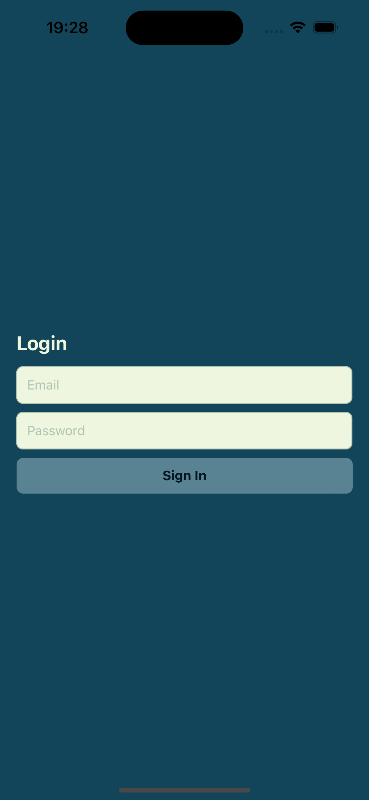
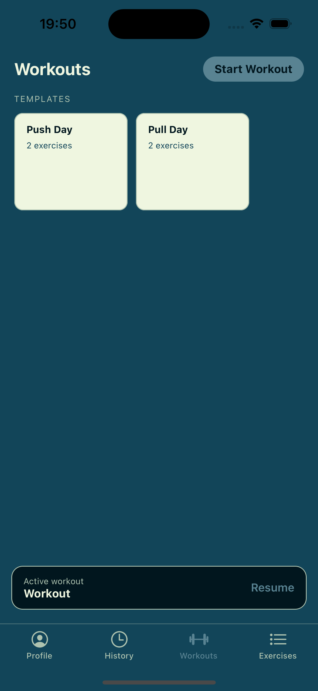
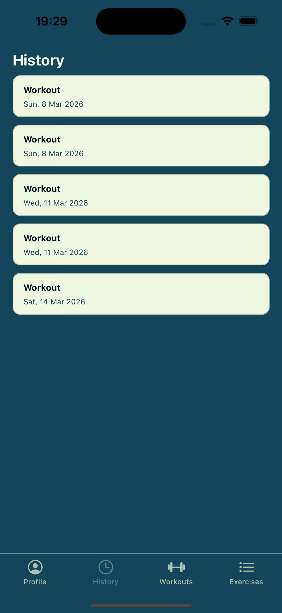
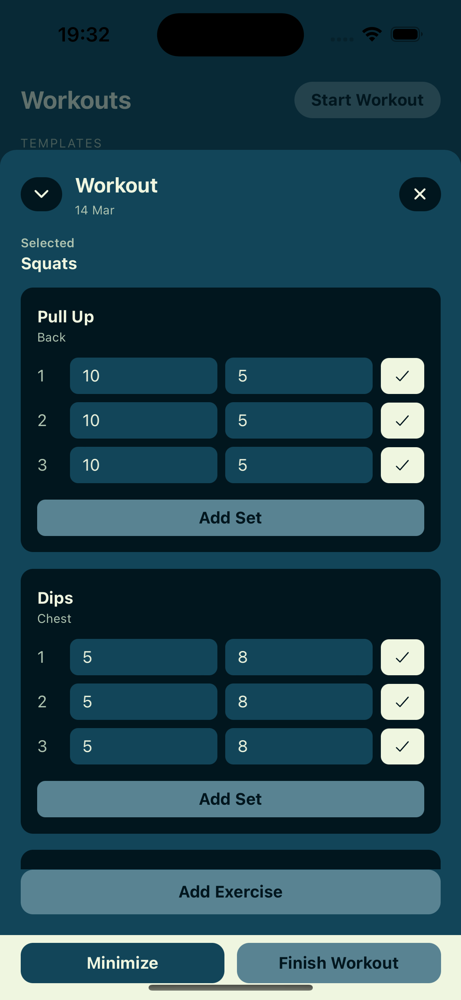
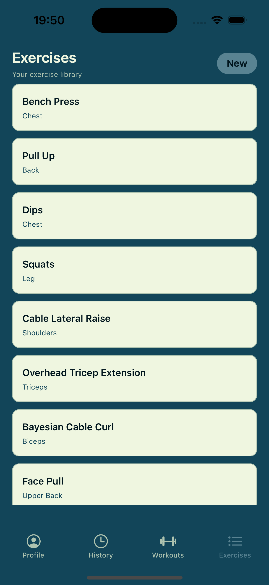
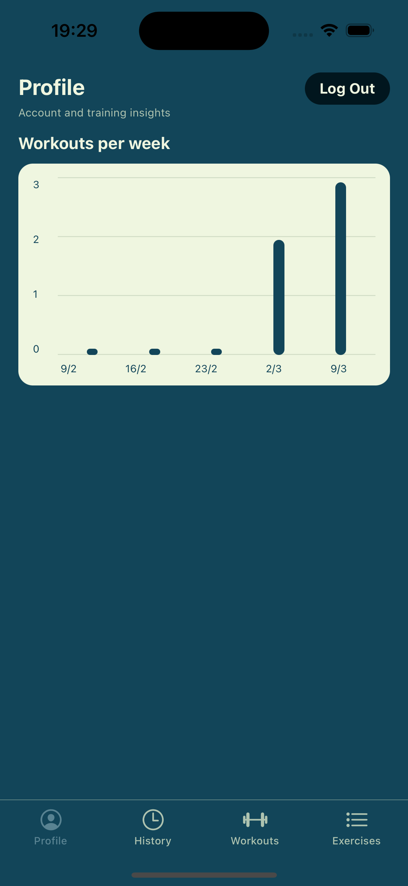

# CaliTrack Mobile

Mobile workout tracker built with Expo + React Native, inspired by Strong/Hevy workflows.

This app focuses on fast workout logging, exercise library management, workout history, and simple profile insights.

## Demo Scope (Portfolio)

Current implemented flow:

- Login with Supabase email/password auth
- Start a workout and manage an active workout state
- Add exercises and record sets (reps/weight/completed)
- Finish workouts and sync to backend
- Browse completed workout history and open workout details
- Manage personal exercise library (add + view)
- View profile insights (weekly workout frequency for the last 4 weeks)
- Log out from Profile

Tab order in app:

1. Profile
2. History
3. Workouts
4. Exercises

## Tech Stack

- React Native 0.83
- Expo 55
- TypeScript
- React Navigation (bottom tabs + native stack)
- Supabase Auth (`@supabase/supabase-js`)
- NativeWind (Tailwind-style RN styling)
- `@gorhom/bottom-sheet` for workout interaction UI

## Architecture Notes

- Frontend: Expo React Native app (this repository)
- Auth: Supabase session-based authentication
- API: Mobile app calls a backend API (`src/lib/api.ts`)
- Backend base URL default: `http://localhost:8080`

Primary API areas used:

- `workouts` (start, list, details, finish, set logging)
- `exercises` (list/create, plus initial seed behavior)
- `analytics/workout-frequency` (profile insights)

## Local Setup

### Prerequisites

- Node.js 20+
- npm
- Expo (via `npx expo`)
- iOS Simulator / Android Emulator / Expo Go
- Backend API running locally

### Install

```bash
npm install
```

### Run

```bash
npx expo start
```

Useful commands:

```bash
npx expo start --ios
npx expo start --android
npx tsc --noEmit
```

## Configuration

### API Base URL

Configured in [`src/lib/api.ts`](src/lib/api.ts):

```ts
const BASE_URL = "http://localhost:8080";
```

For physical devices, use your machine LAN IP instead of `localhost`.

### Supabase

Supabase client is configured in [`src/lib/supabase.ts`](src/lib/supabase.ts).

For production hardening, move keys/URLs into environment-based config and avoid hardcoding.

## Project Structure

```text
src/
├── components/   # Reusable UI (active workout modal)
├── lib/          # API + Supabase client
├── screens/      # Login, Profile, History, Workouts, Exercises, Details
├── theme/        # Color system
└── types/        # Shared TS types (navigation + workout domain)
```

## Roadmap

- Template CRUD and better template editing UX
- Persistent workout drafts across app restarts
- Richer profile insights (volume, streaks, PR trends)
- AI coach flow (chat + suggested workouts/templates) via backend integration
- Test coverage for core data flows

## Screenshots

Add your screenshots to `assets/screenshots/` using the filenames below.

### Login


### Workouts


### History


### Workout Details


### Exercises


### Profile

